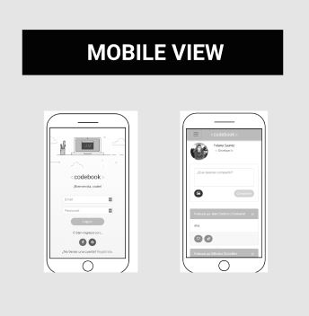
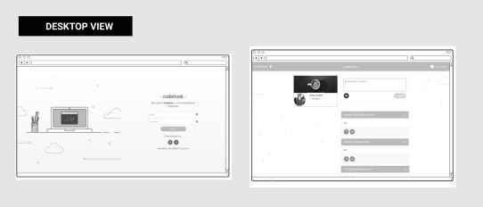
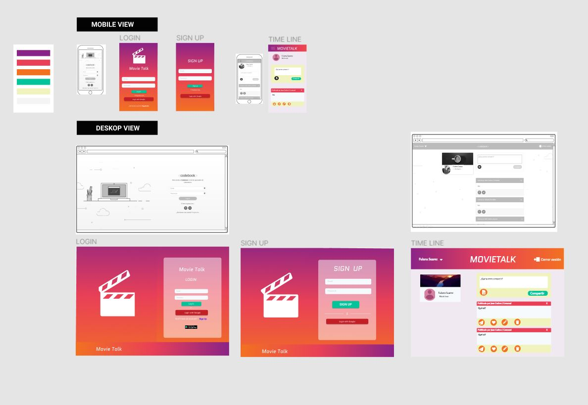
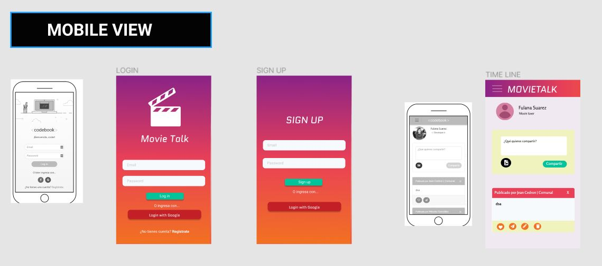
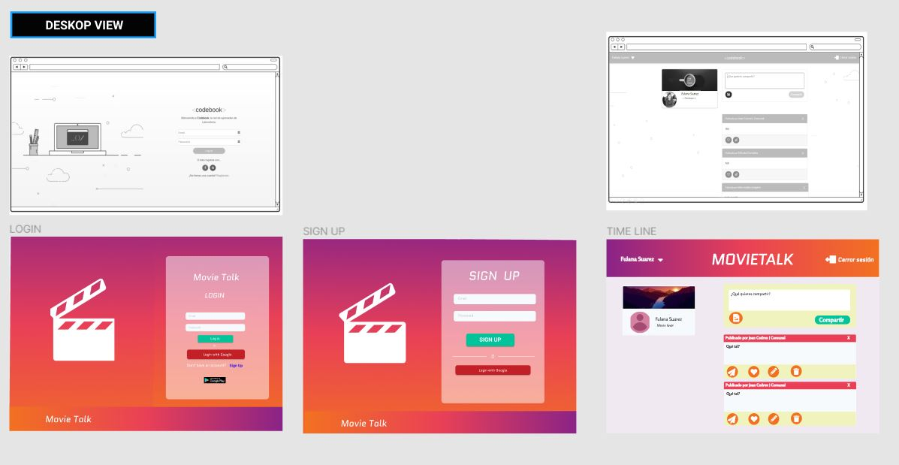
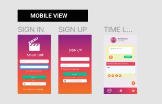
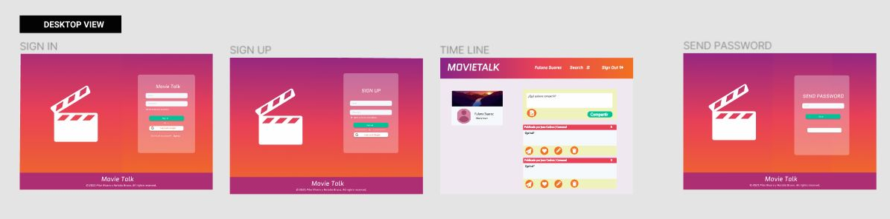
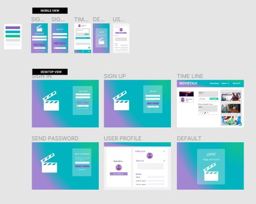
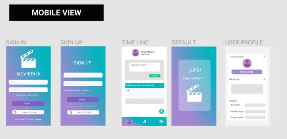
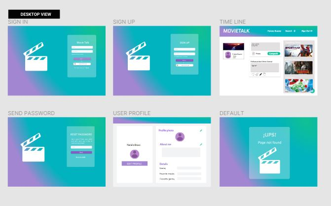

# MovieTalk
***

## 1. Introducción 📖

Las redes sociales juegan un rol importante hoy en día debido a la coyuntura actual, estos se volvieron un medio de comunicación importante a nivel internacional pues permitia que los usuarios interactuaran y compartieran su día a día sin necesidad de estar en el mismo lugar.

## 2. Resumen del proyecto ✒️

MovieTalk es una red social creada para personas que aman ver peliculas y reseñarlas. Esta red social
permitira a los usuarios interactuar entre si de esta manera compartiran una afición en común. Permite a cualquier 
usuario crear una cuenta de acceso y loguearse con ella; crear, editar, borrar y _"likear"_ publicacciones.

## 3. Definición del producto 📝

### ¿Quiénes son los principales usuarios de producto? 🎞️
* Amantes del cine

### ¿Cómo crees que MovieTalk está resolviendo problemas? 🔎
MovieTalk permitira a los usuarios publicar y compartir reseñas de cada película de manera sencilla. 
De este modo los usuarios podran dirigirse a esta red social para poder ver las peliculas mejores reseñadas.

### ¿Para qué le servirá a estos usuarios? 🧍‍♀️🧍
Hoy en día existen diversas plataformas que transmiten peliculas del mismo modo que en el cine, eso hace más complicado la elección cada una.
Con MovieTalk se facilitara la elección de ellas debido a que los usuarios podran ver y compartir reseñas de cada una facilitando la selección.

## 4. Historias de usuario 🗂️

[Trello Data Lovers](https://trello.com/b/CKOH8B0u/lsocial-network-l)

### 📖 HU01: Yo **COMO** usuario **QUIERO** registrarme de diferentes maneras **PARA**  poder ingresar a la red social.

#### Criterios de Aceptación ✏️
* Cuando el ingreso del usuario y contraseña son correctos permitirá el ingreso al sistema
* Cuando el ingreso del usuario y contraseña son incorrectos entonces el sistema NO permitirá el ingreso
* Alerta con el siguiente mensaje:  “Usuario y/o contraseña no válido"
* Usuario autenticarse con redes sociales (Gmail)
* Botón para registrarse
* Boton para resetear contraseña 'Did you forget your password'

#### Definición de Terminado 📌
* Debe ser una SPA.
* Debe ser _responsive_.
* Deben haber recibido _code review_ de al menos una compañera de otro equipo.
* Hicieron los _test_ unitarios
* Testearon manualmente buscando errores e imperfecciones simples.
* Hicieron _pruebas_ de usabilidad e incorporaron el _feedback_ de los
* usuarios como mejoras.
* Desplegaron su aplicación y etiquetaron la versión (git tag).

### 📖HU02: Yo **COMO** usuario **QUIERO** crear una cuenta  **PARA**  poder ingresar a la red social.

#### Criterios de Aceptación ✏️
* Boton que permita crear usuario
* Boton que permita registrar por Gmail
* Casilla marcar para aceptar términos y condiciones
* No permite ingresar un correo de un usuario ya creado
* Validación de correo y contraseña

#### Definición de Terminado 📌
* Debe ser una SPA.
* Debe ser _responsive_.
* Deben haber recibido _code review_ de al menos una compañera de otro equipo.
* Hicieron los _test_ unitarios
* Testearon manualmente buscando errores e imperfecciones simples.
* Hicieron _pruebas_ de usabilidad e incorporaron el _feedback_ de los
* usuarios como mejoras.
* Desplegaron su aplicación y etiquetaron la versión (git tag).

### 📖HU03: Yo **COMO** usuario **QUIERO** crear, editar y borrar publicaciones **PARA** compartir las reseñas en la red social.

#### Criterios de Aceptación ✏️
* Al recargar la aplicación, se debe verificar si el usuario está logueado antes de mostrar contenido.
* Poder publicar un post.
* Poder dar y quitar like a una publicación. Máximo uno por usuario.
* Llevar un conteo de los likes.
* Poder eliminar un post específico.
* Pedir confirmación antes de eliminar un post.
* Al dar click para editar un post, debe cambiar el texto por un input que permita editar el texto y luego guardar los cambios.
* Al guardar los cambios debe cambiar de vuelta a un texto normal pero con la información editada.
* Al recargar la página debo de poder ver los textos editados.

#### Definición de Terminado 📌
* Debe ser una SPA.
* Debe ser _responsive_.
* Deben haber recibido _code review_ de al menos una compañera de otro equipo.
* Hicieron los _test_ unitarios
* Testearon manualmente buscando errores e imperfecciones simples.
* Hicieron _pruebas_ de usabilidad e incorporaron el _feedback_ de los
* usuarios como mejoras.
* Desplegaron su aplicación y etiquetaron la versión (git tag).

### 📖HU04 : Yo **COMO** usuario **QUIERO** que el aplicativo me permita resetear la contraseña **PARA** poder recuperar mi cuenta si en algún momento la olvido

#### Criterios de Aceptación ✏️
* Email de usuario creado
* Conexión con Firebase
* Botón que envié el mensaje de reseteo a bandeja de entrada

#### Definición de Terminado 📌
* Debe ser una SPA.
* Debe ser _responsive_.
* Deben haber recibido _code review_ de al menos una compañera de otro equipo.
* Hicieron los _test_ unitarios
* Testearon manualmente buscando errores e imperfecciones simples.
* Hicieron _pruebas_ de usabilidad e incorporaron el _feedback_ de los
* usuarios como mejoras.
* Desplegaron su aplicación y etiquetaron la versión (git tag).

### 📖HU05 : Yo **COMO** usuario **QUIERO** poder ver mi perfil con mi información y actualizarla **PARA** que los demas usuarios puedan conocerme.

#### Criterios de Aceptación ✏️
*  Nombre del usuario registrado
*  Foto del usuario registrado
*  Sección donde muestre un breve descripción del usuario
*  Botón para editar perfil

#### Definición de Terminado 📌
* Debe ser una SPA.
* Debe ser _responsive_.
* Deben haber recibido _code review_ de al menos una compañera de otro equipo.
* Hicieron los _test_ unitarios
* Testearon manualmente buscando errores e imperfecciones simples.
* Hicieron _pruebas_ de usabilidad e incorporaron el _feedback_ de los
* usuarios como mejoras.
* Desplegaron su aplicación y etiquetaron la versión (git tag).

### 📖HU06 : Yo **COMO** usuario **QUIERO** que el aplicativo pueda verificar mi cuenta por mensaje electronico **PARA** comprobar que me registre correctamente.

#### Criterios de Aceptación ✏️
* Ingreso de email creado
* Conexión con Firebase
* Botón que permita enviar un enlace de recuperación a su bandeja de entrada

#### Definición de Terminado 📌
* Debe ser una SPA.
* Debe ser _responsive_.
* Deben haber recibido _code review_ de al menos una compañera de otro equipo.
* Hicieron los _test_ unitarios
* Testearon manualmente buscando errores e imperfecciones simples.
* Hicieron _pruebas_ de usabilidad e incorporaron el _feedback_ de los
* usuarios como mejoras.
* Desplegaron su aplicación y etiquetaron la versión (git tag).

## 5. Diseño de Interfaz de Usuario 🛠️
### Prototipo de baja fidelidad

### Prototipo de alta fidelidad
#### Prototipo I

#### Prototipo II

#### Prototipo III

 

Link : [Figma](https://www.figma.com/file/eHKuxNrucdg9t1KZNLQaxF/SOCIAL-NETWORK?node-id=0%3A1)

